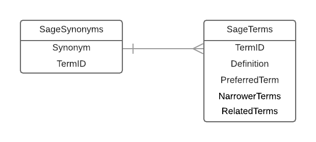

# sage-alexa-definitions

# Development

## Technical Design

The SAGE Research Methods (SRM) skill has the following components:

* _Alexa skill definition (Amazon Developer Console / json)_: describes the Alexa skill to Amazon in terms of acceptance utterances, recognisable terms, synonyms, etc. 
* _DynamoDB (Amazon Web Services)_: stores terms, synonyms, definitions, and relationships for use in the skill.
* _Data loading script (Python)_: takes a SKOS file of SRM terms and synonyms, and loads them into an AWS data store. Also generates the Alexa skill definition.
* _Lambda script (AWS / Python)_: provides a service that the Alexa skill uses to retrieve spoken responses to user queries. The lambda retrieves term definitions (etc) from DynamoDB, then returns English sentences for Alexa to read out.
* _Alexa skill configuration (Amazon Developer Console)_: Configuration for skill beta testing and deployment, plus various other skill configuration is fully embedded into the Amazon Developer Console.

Note that the data loading script should be run locally, while everything else is hosted in the Cloud. 

## Accessing AWS / cloud resources

**1. Obtain AWS credentials**

You will need an username and password for the following AWS account: 7445-2629-2976

Make sure you have all of the following, for your user:

* User name
* Password
* Access key ID
* Secret access key

You'll need these to access the Amazon console, and to run access AWS from your local environement.

**2. Create an Amazon developer account (optional)**

The Alexa skill needs to be owned by a single [Amazon developer account](https://developer.amazon.com/). The version recently demoed is owned by Alan Maloney, so the skill definition can only currently be modified by him. 

To independently deploy the skill, you will need your own Amazon developer account.

## Loading Sage Research Method definitions into DynamoDB

**1. Install Python**

The data loading script requires Python 3 to be installed on your local machine. The following resources provide installation instructions:

[Python on Windows](https://docs.python.org/3/using/windows.html)
[Python on Mac](https://docs.python.org/3/using/mac.html)

Note that Python version 3 executables typically include the number '3', e.g. python3, pip3.

**2. Install required python packages**

The data loading script requires the following Python packages, all of which can be installed with the Python's built-in package manager:

* awscli
* simplejson

To install a package, use the command `'pip3 install {packagename}'`. 

Note that the awscli package includes command line tools for working with AWS services (e.g. the `aws` command). You may need to modify your PATH environment variable to run these commands.

**3. Set up your environment**

Next, make sure that:

- the 'python3' executable is on your path
- the following environment variables have been set up:

```
AWS_ACCESS_KEY_ID={your access key ID}
AWS_SECRET_ACCESS_KEY={your secret access key}
AWS_DEFAULT_REGION=us-east-1
AWS_DEFAULT_OUTPUT=json
```

I recommend creating a small script to set these up for you. 

A unix-like template for such a file can be found in the file `env.sh`. It can be run using the unix `source` command which runs in the current environment, and retains any newly defined environment variables. 

**4. Extract the SRM definitions in skos format**

You will need a file of SRM definitions in the [SKOS](https://www.w3.org/2004/02/skos/) format, e.g.:

``` xml
  <rdf:Description rdf:about="SRM0100">
    <rdf:type rdf:resource="http://www.w3.org/2004/02/skos/core#Concept" />
    <skos:broader rdf:resource="SRM0057" />
    <skos:broader rdf:resource="SRM0101" />
    <skos:related rdf:resource="SRM0100" />
    <skos:related rdf:resource="SRM0427" />
    <skos:prefLabel xml:lang="en">Praxis</skos:prefLabel>
    <skos:definition xml:lang="en">A term with no precise equivalent in English, it refers to a form of human action concerned with what is right and good in a given situation, and the competence, sensibility, and sensitivity required to make such judgements.</skos:definition>
  </rdf:Description>
```

Alan Maloney is the maintainer of the master data definitions of SRM terms, and can export a complete set of definitions in SKOS format. 

**5. Download the Alexa skill definition json**

Before running the script, you will need a copy of the currently deployed Alexa skill definition, in JSON format. This can be downloaded from the Amazon Developer Console.

The relevant console page for the Demo Alexa app (owned by Alan Maloney) can be found [here](https://developer.amazon.com/alexa/console/ask/build/custom/amzn1.ask.skill.d92b89ac-f809-447c-8c29-556976594ff6/development/en_GB/json-editor).

Select all the JSON in JSON Editor, then save this text to file on your local machine. I recommend storing the Alexa skill definition file and the SRM definitions file in the same location as this README, alongside the data loading script.

⚠ _Make sure you download the latest Alexa skill definition, rather than using an a version you downloaded previously!_ 

**6. Run the script**

Use the following command to load the SRM terms, definitions, and synonyms into DynamoDB.

```python3 skos_def_processor.py {SRM-definition-file} {alexa-skill-def-file}```

The script displays some database status information, prints term IDs and syonyms as they are loaded, then creates and updated version of your Alexa skill definition file.

```
Reading SKOS file
Updating sage table:
   Name:          SageTerms
   ARN:           arn:aws:dynamodb:us-east-1:744526292976:table/SageTerms
   ID:            46e6cf97-ad4b-48a6-9d84-d1616ced9189
   Creation date: 2018-04-03 17:39:20.105000+01:00
   Status:        ACTIVE
   Item count:    659
   Size (bytes):  145402
Writing term SRM0429
Writing term SRM0048
... (snip) ...
Writing term SRM0628
Writing term SRM0498
Updating sage table:
   Name:          SageSynonyms
   ARN:           arn:aws:dynamodb:us-east-1:744526292976:table/SageSynonyms
   ID:            da63d5c6-4e64-4c50-b48d-ee366bfa9da0
   Creation date: 2018-04-03 17:38:10.872000+01:00
   Status:        ACTIVE
   Item count:    1110
   Size (bytes):  41002
Writing synonym nested models
Writing synonym ethnomethodology
... (snip) ...
Writing synonym researcher development
Writing synonym factor scales
Loading Alexa skill definition 'alexa_skill_def.json'
Updating Alexa skill slot values (659 terms)
Writing Alexa skill definition 'alexa_skill_def_updated.json'
```

Note that:

* For new terms and synonyms, new records will be created
* Existing data will NOT be deleted from DynamoDB
* The script overwrites existing records rather than performing a wholesale replacement. This means that old definitions may hang around in the Alexa skill after deletion from the master data store.
* If you make major changes to SRM definitions, such as deleting terms or changing synonyms, consider clearing the tables manually using the AWS console.

**7. Load new alexa skill definition json**

The data loading script will have created a new Alexa skill definition, based on the one you provided. The only change will be to the TERM_NAME slot type, other definition data is untouched. 

The term names are required in the Alexa skill definition as well as DynamoDB; Alexa uses the term names and synonyms for voice recognition.

The new definition file will have `updated` in it's name, e.g.:

```
-rw-r--r--   1 jsiddle  staff    1714 11 Apr 14:54 alexa_skill_def.json
-rw-r--r--   1 jsiddle  staff  218629 13 Apr 10:46 alexa_skill_def_updated.json
```

Load this updated JSON definition into the Amazon Developer Console, using the JSON Editor page (where you downloaded the definition in the first place). Look for "Drag and Drop a json file" on the JSON Editor screen.

**8. Build the skill**

Finally, build the model, using the "Build Model" button that you should see when looking at the JSON Editor, or otherwise working with the Interaction Model.

Once Amazon says the build is complete, the new definitions should be available via the Skill. You're done!


## How to access the database 

DynamoDB has a self-contained, easy to use web UI for working with stored data. 


You can use the web interface to:
- Query terms / synonyms / definitions
- Add, edit, or delete terms or synonyms
- Clear data wholesale, if you want a clean refresh

You can access the web UI [here](https://console.aws.amazon.com/dynamodb/home?region=us-east-1#tables:selected=SageTerms).


## Data Model

The data model for the Alexa skill can be seen in the following Entity Relationship Diagram:



The `SageSynonyms` table records all known synonyms, and their associated term IDs. It is used to go from an English-language term to the canonical identifier for the Term; in many cases, multiple synonyms map to the same canonical term.

For example the both `psychometrics` and `psychological tests`, map to SRM0172.

The `SageTerms` table records the canonical terms, including IDs, definitions, preferred name, and links to other terms. It is used to compose the bulk of the spoken responses for the skill. 

# Named Entity Resolution

Note that the Sage Research Methods skill uses Named Entity Recognition to identify terms in speech.

This capability is built in to Alexa. The Skill definition (i.e. the uploaded JSON, see above) is used as training data for speech recognition. Specifically, the TERM_NAME slot type provides the canonical "objects" that Alexa tries to recognise in speech - it uses the provided values and all associated synonyms for matching purposes.

The lambda service receives both the "spoken term" that Alexa heard, as well as the canonical term that it resolved the speech to.

For example: 

* Alexa hears `psychological test` (singular)
* Alexa applies fuzzy matching to match `psychological tests` (plural), which is a synonym found in the skill definition
* Alexa knows `psychological tests` is a synonym for the canonical term `psychometrics`
* Alexa sends the lambda the original spoken term it heard, plus the resolved canonical term (so we receive `psychological test / psychometrics`)

# Deployment and Usage

## How to add users to the Beta

## Going live

## Using the Skill

alexa, ask sage to define [term]
alexa, ask sage to decompose [term]

Fuzzy matching (skepticism)
"typically known as" (psychometrics vs psychological tests)


## Finding user queries in the logs

1. Log in to AWS CloudWatch
2. Access the sageDefineTerms log group, click Search Log Group. 
[Shortcut link](https://console.aws.amazon.com/cloudwatch/home?region=us-east-1#logEventViewer:group=/aws/lambda/sageDefineTerms)
3. Enter "Alexa resolved"
4. Enter "Alexa failed" 


